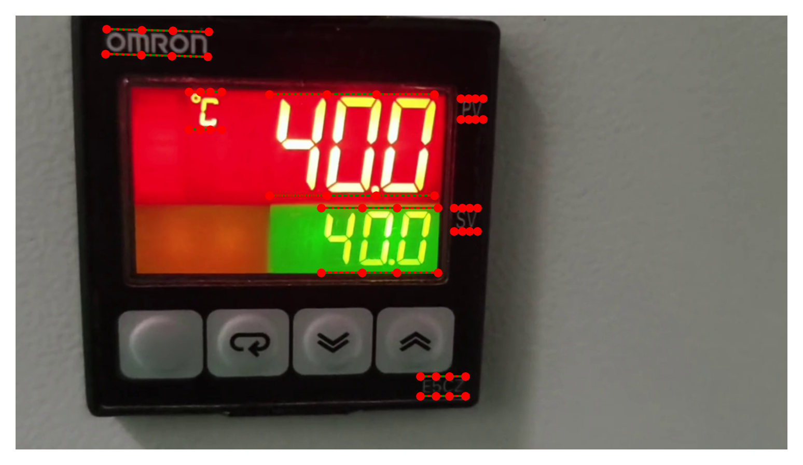
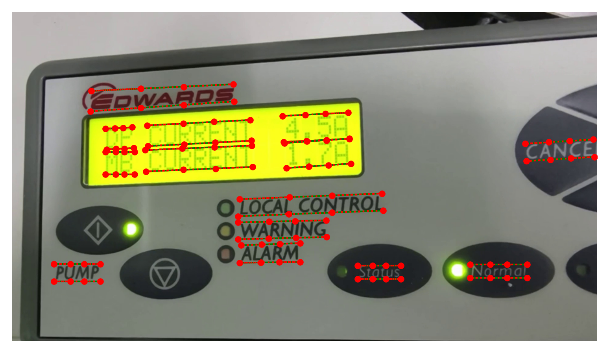
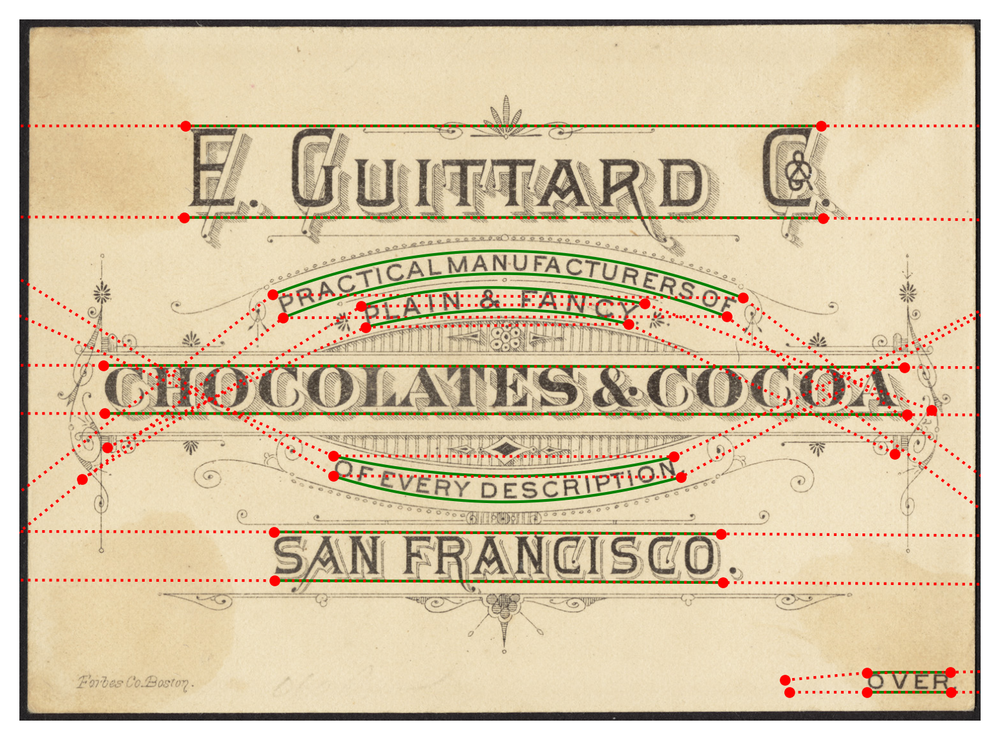
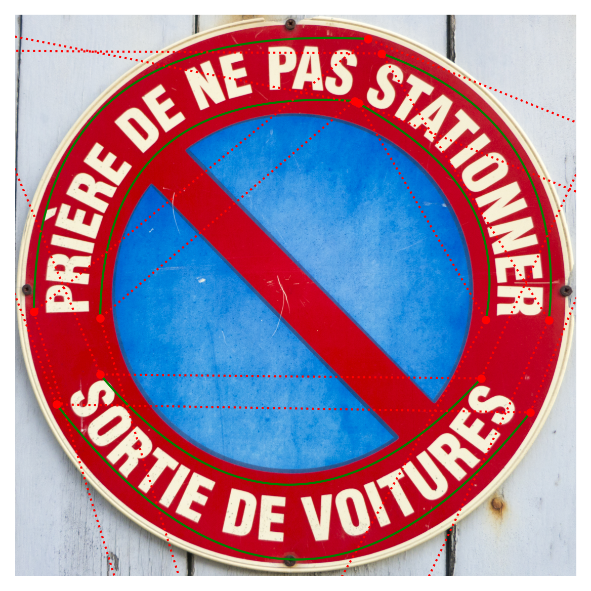
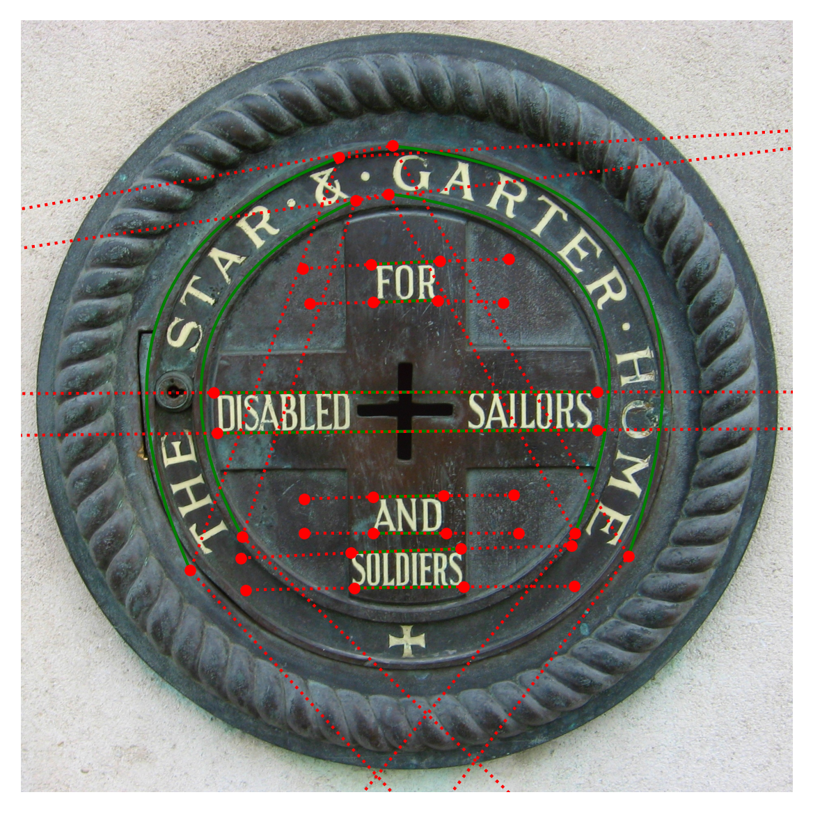

# EdgeSpotter: Multi-Scale Dense Text Spotting for Industrial Panel Monitoring

### Changhong Fu, Hua Lin, Haobo Zuo, Liangliang Yao, Liguo Zhang

## 📌 Abstract
>Text spotting for industrial panels is a key task for intelligent monitoring. However, achieving efficient and accurate text spotting for complex industrial panels remains challenging due to issues such as cross-scale localization and ambiguous boundaries in dense text regions. Moreover, most existing methods primarily focus on representing a single text shape, neglecting a comprehensive exploration of multi-scale feature information across different texts. To address these issues, this work proposes a novel multi-scale dense text spotter for edge AI-based vision system (EdgeSpotter) to achieve accurate and robust industrial panel monitoring. Specifically, a novel Transformer with efficient mixer is developed to learn the interdependencies among multi-level features, integrating multi-layer spatial and semantic cues. In addition, a new feature sampling with catmull-rom splines is designed, which explicitly encodes the shape, position, and semantic information of text, thereby alleviating missed detections and reducing recognition errors caused by multi-scale or dense text regions. Furthermore, a new benchmark dataset for industrial panel monitoring (IPM2025) is constructed. Extensive qualitative and quantitative evaluations on this challenging benchmark dataset validate the superior performance of the proposed method in different challenging panel monitoring tasks. Finally, practical tests based on the self-designed edge AI-based vision system demonstrate the practicality of the method.
 


This figure shows the workflow of our EdgeSpotter. Check out the *[demo video](https://youtu.be/3ix5JWObuFE)* for more information.

## ✨ About Code

### 1. **Environment Setup** 🛠️  

This code has been tested on **Ubuntu 22.04**, **Python 3.9**, **PyTorch 2.0.0**, **CUDA 11.8**, and **Detectron2**.  
Please install the required dependencies before running the code:  

```bash
# Clone the repository
git clone https://github.com/vision4robotics/EdgeSpotter.git
cd EdgeSpotter

# Create and activate a conda environment
conda create -n edgespotter python=3.9 -y
conda activate edgespotter

# Install PyTorch and dependencies
pip install torch==2.0.0+cu118 torchvision==0.15.1+cu118 -f https://download.pytorch.org/whl/torch_stable.html

# Install additional dependencies
pip install -r requirements.txt
```
The installation of Detectron2 can be found at *[Detectron2](https://github.com/facebookresearch/detectron2)*. Alternatively, you can run the following:
```bash
git clone https://github.com/facebookresearch/detectron2.git
cd detectron2 
pip install -e .
cd ..
```
Once installed, run the following command:
```bash
python setup.py build develop
```
### 2. **Label generation** 📝
The following Python 3 example demonstrates how to create a custom dataset for EdgeSpotter training. Before starting, ensure you have the necessary data annotations and corresponding images in the format provided in the *[folder](gen_data/datasets_example)*. Public datasets for training can be found *[here](https://github.com/aim-uofa/AdelaiDet/tree/master/datasets)*.

🔹**Step 1:** Generate Catmull-Rom curve annotations based on the given polygon annotations.
```bash
cd gen_data
python Catrom_curve_generation.py
```
🔹**Step 2:** Convert the Catmull-Rom curve annotations into a COCO-like annotation format for EdgeSpotter training.
```bash
python generate_edgespotter_json.py
```
**Note:** Modify the path in the script as needed. If your spotting target does not include curved text, set the scaling factor to `scale_factor=0.1`; otherwise, use the default value of `scale_factor=1`.
 
🖼️ Here are some examples *(a smaller scale factor results in a tighter curve)*:

<table>
    <tr>
        <td></td>
        <td></td>
    </tr>
</table>

🔧 **IPM2025** *(scale_factor=0.1)*

<table>
    <tr>
        <td></td>
        <td></td>
        <td></td>
    </tr>
</table>

🔧 **CTW1500** *(scale_factor=1)*

### 3. **Run** ▶️

🔹<**Train**>

```bash
python tools/train_net.py --config-file ${CONFIG_FILE} --num_gpus ${NUMBER}
```
For example:
```bash
python tools/train_net.py --config-file configs/R_50/IPM/finetune_96voc_25maxlen.yaml --num-gpus 2
```
> **Note:** After preparing your own dataset, you can either fine-tune it using the *[weights](https://drive.google.com/drive/folders/1-WU9o_SvGrg4e3NOgaHPtdfCpsbqAavC?usp=sharing)* we provide, or re-start your training.

🔹 <**Test**>

Before getting started, you can obtain a video example *[here](https://drive.google.com/drive/folders/1__TnS2GyYqususQ1y3m30ydBWLeBOPDB?usp=drive_link)*.
```bash
python demo/demo_video.py --config-file ${CONFIG_FILE} --input ${VIDEO} --opts MODEL.WEIGHTS ${WEIGHTS}
```
For example:
```bash
python demo/demo_video.py --config-file configs/R_50/IPM/finetune_96voc_25maxlen.yaml --input test_video/test.mp4 --opts MODEL.WEIGHTS ours.pth
```

### 4. **Deployment** 🚀

🔹 <**Install**>

```bash
cd Deploy
python setup.py sdist bdist_wheel
pip install dist/*.whl
mv edgespotter edgespotter-base
```
🔹 <**Demo**>

```bash
python demo.py
```
More details can be found *[here](Deploy/README.md)*.

### 5. **Contact** 📞
If you have any questions, please contact me.

Hua Lin

- Email: *[1951406@tongji.edu.cn](1951406@tongji.edu.cn)*

For more evaluations, please refer to our paper.

## 🙏 Acknowledgement
* The code is implemented based on *[DeepSolo](https://github.com/ViTAE-Transformer/DeepSolo)*. We would like to express our sincere thanks to the contributors.
* We sincerely thank *[AdelaiDet](https://github.com/aim-uofa/AdelaiDet)* and *[Detectron2](https://github.com/facebookresearch/detectron2)*  for their valuable contributions.
